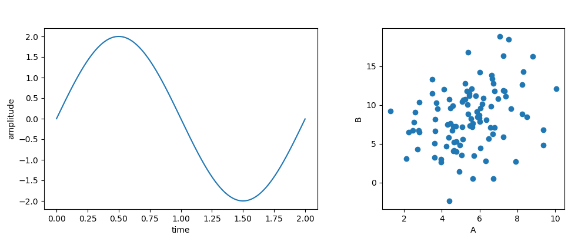

Composing Figures
=================

Pylustrator can also be used to compose panels of different subplots using the function the function `pylustrator.load()`.

Example
-------

Suppose we have two plot files that we want to include in our figure:

.. sidebar:: Plot 1

    .. image:: plot1.png
       :height: 150px

.. literalinclude:: plot1.py
   :caption:
   :language: python
   :linenos:

.. raw:: html

    

.. sidebar:: Plot 2

    .. image:: plot2.png
       :height: 150px

.. literalinclude:: plot2.py
   :caption:
   :language: python
   :linenos:

.. raw:: html

    

Now we can create a script that generates the composite figure:

.. literalinclude:: figure1.py
   :caption:
   :language: python
   :linenos:
   :emphasize-lines: 4,5

The subfigures can both contain also multiple axes (e.g. subplots) or be previously styled with pylustrator. The composite
figure can also be styled with pylustrator to finialize the figure.

.. Note:: Please note that the code of the target script will be executed, to only load script files from trusted sources.
    This also holds true when loading scripts from a cached pickle representation, see `Caching`_.

Supported Formats
-----------------

With `pylustrator.load()` different types of inputs can be used to add to a composite figure.

Python Files
~~~~~~~~~~~~
If the input is a ".py" file then the file is compiled and executed. All the figure elements that are generated from the
python file are then inserted into the target figure.

.. Note:: All your plotting code should be in the main part of the script, everything hidden behind a
    `if __name__ == "__main__":` will be ignored.

Image Files
~~~~~~~~~~~
If the input is any image format that can be opened with `plt.imread()` then the file is loaded and its content is displayed
in a separate axis using `plt.imshow()`. To scale the image, pylustrator uses the dpi settings of the figure. You can also
provide the `dpi` keyword to `pylustrator.load()` to scale the image.

Svg Files
~~~~~~~~~
If the input file is a `svg` file, then pylustrator tries to generate matplotlib patches to display the content of the svg
file in a new axes.

.. Warning:: The svg loading is still preliminary and does not include all svg features. It is probable that the data
    shown in the matplotlib window looks different than the source svg file.

Positioning
-----------
Loaded subfigures can be positioned using the `offset` keyword. Offsets can have different units.

The default unit is to
interpret it as a percentage of the current figure size. Note, that when calling multiple imports, the figure size changes
between calls. Therefore, a 2x2 grid can be achieved with relative offsets as follows:

.. code-block:: python
    :linenos:

    pylustrator.load("plot1.py")
    pylustrator.load("plot2.png", offset=[1, 0])
    pylustrator.load("plot3.jpg", offset=[0, 1])
    pylustrator.load("plot4.svg", offset=[0.5, 0.5])

The offset can also be specified in cm or in in. Therefore, the third entry of the tuple can be the string "cm" or "in".
For example:

.. code-block:: python
    :linenos:

    pylustrator.load("plot1.py")
    pylustrator.load("plot2.png", offset=[2, 1, "cm"])
    pylustrator.load("plot3.jpg", offset=[0.3, 0.9, "in"])

Caching
-------
Pylustrator also offers the posibility to cache the figures generated by a script file. Therefore, the figure is pickled
after it has been created from the script and saved next to the script. If the script is newer (last modified timestamp)
as the pickle file with the cached figure, the script is executed again. The caching behavior can be disabled with the
keyword `cache=False`.
